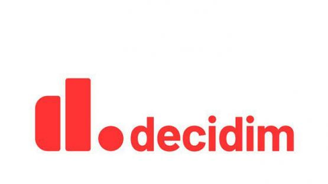
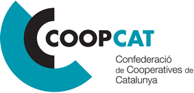

# Què és Cercles Coop?

## Què és Cercles Coop?

És un repositori digital de recursos de codi obert per preparar i celebrar reunions societàries virtuals amb les garanties jurídiques establertes per la normativa vigent. Va adreçat a cooperatives i federacions de cooperatives. També a entitats i organitzacions de l’economia social que tinguin incorporats en els seus òrgans processos democràtics de participació.

Cercles Coop inclou una guia de recomanacions jurídiques, una guia de recomanacions tècniques, la plataforma de votació i la guia d'ús d'aquesta.

Alhora, la Plataforma de votació Cercles Coop es basa en una adaptació de la Plataforma Decidim, per tal d’incorporar els sistemes de participació i votació de la societats cooperatives d’acord amb el que s’estableix en la pròpia Llei de Cooperatives 12/2015 i el Decret Llei 19/2020.

## Què és Decidim?

És una plataforma participativa de codi obert per a ciutats i organitzacions.

Amb [Decidim](https://decidim.org) es poden configurar espais de participació \(iniciatives, assemblees, processos o consultes\) i enriquir-los a través dels múltiples components disponibles \(trobades presencials, enquestes, propostes, votacions, seguiment de resultats, comentaris i molts més\).

## Com puc utilitzar **Cercles Coop**?

CoopCat ofereix aquest servei a través del qual mancomunem el cost de manteniment en una plataforma gestionada per CoopCat i les Federacions de cooperatives. [**Sol·licita-ho aquí**](mailto:ccc@cooperativescatalunya.coop%20%20%20)\*\*\*\*

Els recursos d'aquesta guia han estat elaborats per [Confederació de Cooperatives de Catalunya](https://www.cooperativescatalunya.coop/) \(CoopCat\) i estan subjectes a una llicència de Reconeixement-NoComercial-CompartirIgual 4.0 Internacional de Creative Commons.

El codi desenvolupat s'ha realitzat sota llicència [AGPL 3.0](http://www.gnu.org/licenses/agpl-3.0.html)

