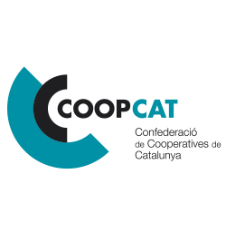

# Toolkit Assemblees virtuals

## Abans de començar

Aquesta guia inclou un seguit d'eines i la seva configuració per tal de poder organitzar assemblees generals virtuals de cooperatives amb garanties legals.

Aquesta guia ha estat el·laborada per [Confederació de Cooperatives de Catalunya](https://www.cooperativescatalunya.coop/) i és pot compartir sota llicència [CC BY-SA 3.0](https://creativecommons.org/licenses/by-sa/3.0/) 

### ¿Què necessitem per organizar una assemblea general de sòcies?

Cada cooperativa compta amb uns estatuts pròpis que els habilita a realitzar la seva assemblea general amb diferents especifitats, no obstant hi ha un seguit de funcionalitats necessàries que són requerides per tal de poder organitzar una assemblea general virtual:  

1. Emissió de video en directe
2. Participació de les sòcies en directe
3. Votacions durant l'assemblea

En aquesta guia proposarem un seguit d'eines que cobriran els punts 1 i 2, en canvi pel que fa al punt 3 ens centrarem únicament en la plataforma [Decidim](https://decidim.org/) sobre la que s'han desenvolupat diverses funcionalitats des del cooperativisme i que ja fan servir diverses cooperatives.  

