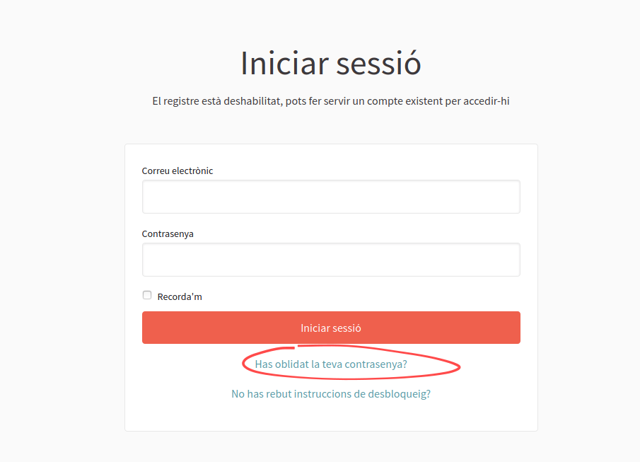
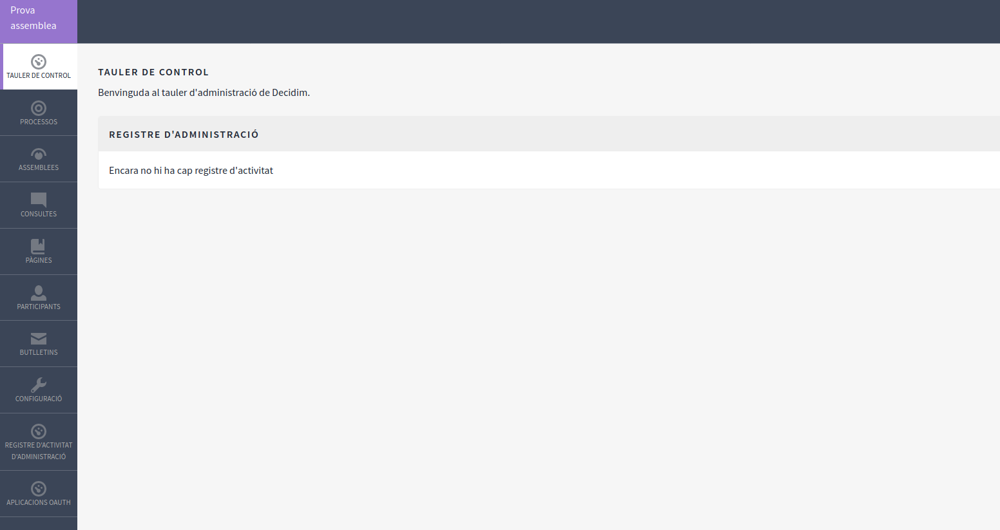
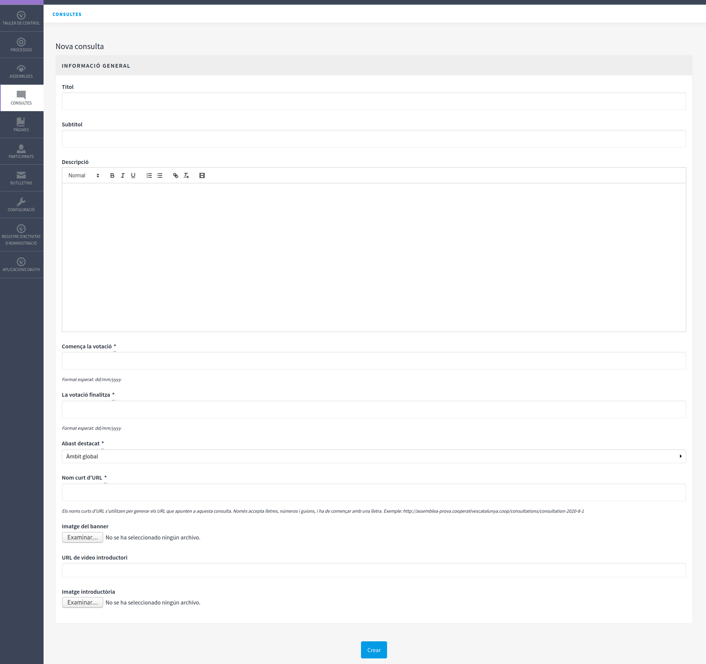

# 3. Manual per crear una reunió societària virtual


Assumint que ja teniu disponible una [instància de Decidim](../#com-puc-utilitzar-cercles-coop) i un [sistema de emissió de vídeo](necessitats-tecniques-per-organitzar-i-celebrar-reunions-virtuals.md#1-emissio-de-video-en-directe) seleccionat. 



Podeu consultar documentació més amplia sobre Decidim a [https://docs.decidim.org](https://docs.decidim.org) No obstant si voleu fer servir les funcionalitats que CooCat ha validat us recomanem seguir únicament aquesta guia. 


Si has sol·licitat la creació d'un Decidim i ets el primer administrador hauràs rebut un correu per registra-te, en cas que aquest correu no t'hagi arribat pots recordar la contrasenya. Fent clic a l'enllaç de dalt a la dreta **Entra**



També la primera vegada que s'accedeix a **/pages/terms-and-conditions** s'han d'acceptar els termes i condicions del servei abans de poder realitzar accions a la administració.

Un cop fet ja podem accedir al panell d'administració, al menú de dalt a la dreta t'apareixerà la opció "Taulell de administració"



### Preparació


Si fas servir el servei ofert per cercles.coop ja tindràs creades Pàgines, Àmbits pots saltar a la creació de la [Consulta](posada-en-marxa.md#consultes)


#### Pàgines informatives

En la administració en la secció **Pàgines** podem editar els continguts de les pàgines, podem crear/editar/suprimir diversos Temes i Pàgines explicatives, però obligatoriament hem de tenir les següents pàgines: 

* FAQ \(preguntes freqüents\) **pages/faq**
* Termes i condicions **pages/terms-and-conditions**
* Accessibilitat **pages/accessibility**

#### **Àmbits**

Abans de crear una consulta necessitem crear un àmbit, si no esperem tenir diversitat d'àmbits en que és realitzen les consultes podem crear sols un anomenat "reunió societària" per qualsevol reunió i després un àmbit concret per les preguntes tipus "assemblea general"

A la administració, secció **Configuració &gt; Àmbits** fem clic a dalt a la dreta **Afegir**

* **Nom:** reunió societària
* **Codi:** reunio-societaria

Un cop creada fem clic a sobre **reunió societària** i dins podrem **Afegir** un "sub àmbit" que anomenarem 

* **Nom:** assemblea general
* **Codi:** assemblea-general

#### Consultes

El mòdul de consultes és el que farem servir per organitzar les votacions a una determinada reunió, si anem a la secció **Consultes** en el menú de administració podrem crear una nova consulta fent clic al botó de dalt a la dreta **Nova consulta**



Si emetem el video a través d'un sistema de broadcasting, com youtube, el podem afegir al camp **URL de vídeo introductori** [tal com s'explica aquí](../video-de-la-assemblea/videoconferencia/mode-broadcasting.md#mostrar-el-video-de-youtube-a-decidim).

Hem d'omplir els següents camps:

* ...
* Abast destacat: Reunió Societària
* Comença la votació: Data de la assemblea
* La votació finalitza: Data de la assemblea
* ...


Fins que no fem clic a **Publicar** la consulta no serà visible pels visitants.



Quan vulguem obrir la votació canviarem la data de **Comença la votació** a un dia anterior a avui, quan volguem tancar la votació mourem la data de **La votació finalitza** a un dia anterior a avui.


#### Preguntes de la consulta

Dins de la Consulta creada podrem crear totes les preguntes i respostes possibles per cada una d'ella


Per poder publicar cal que es creïn les respostes


#### Importació de les participants

Format document CSV  
Primera linea capçalera, separant columnes amb comes i sense espais:

```text
email,nom,membership_phone,membership_type,membership_weight
```

Següents línies de dades, separant columnes amb comes i sense espais:

```text
email,nom,membership_phone,membership_type,membership_weight
joana@example.com,joana garcia,76318371,treballadora,3
miqul@example.com,miquel,653565765,treballadora,2
[...]
```

**membership\_type** i **membership\_weight** representen tipologia de sòcies, i ponderació del vot, respectivament aquesta dada es farà servir per mostrar resultats agrupant sòcies amb la mateixa tipologia i poderació de vot. Per tant en el exemple si hem fet servir tipologia sòcia "treballadora" és important que fem servir exactament el mateix text per totes les sòcies de tipus "treblladora".

### Reunió

#### Votacions

#### Visualització de resultats

### 

