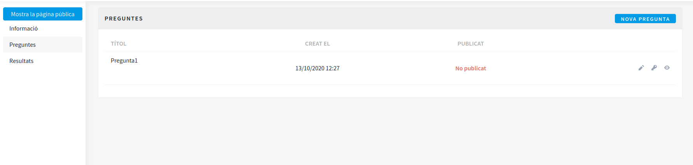
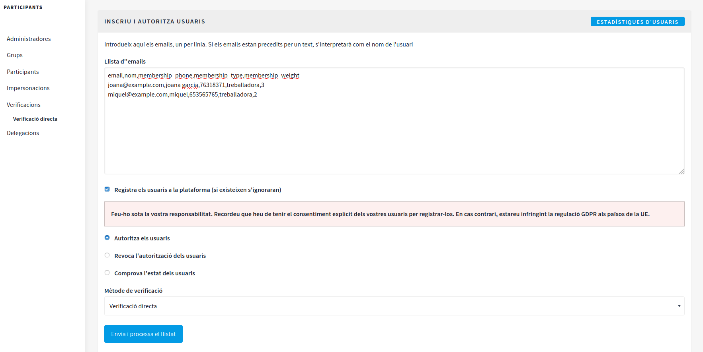
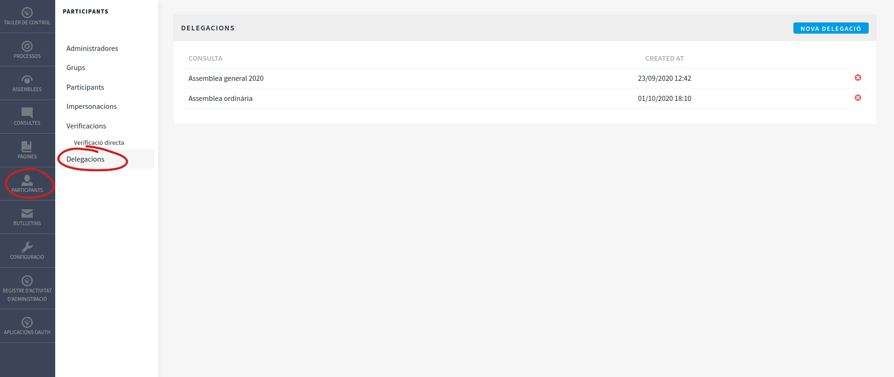
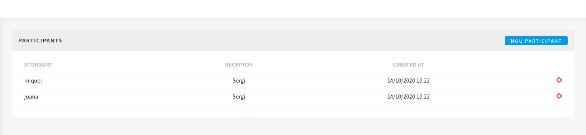
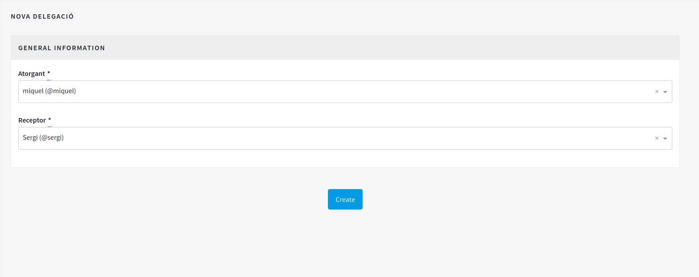
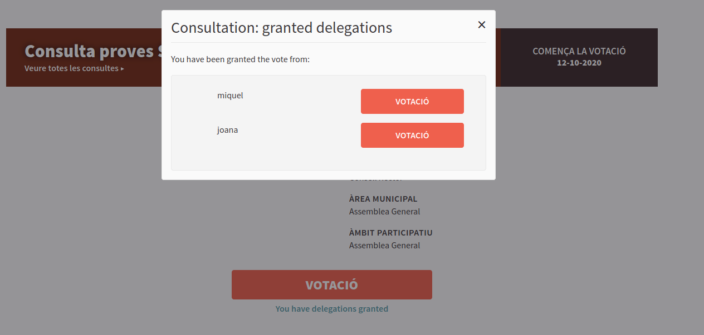

# 3. Manual per crear una votació societària virtual a Cercles.Coop
**Manual per crear una reunió societària: ordre del dia, documentació associada i paràmetres de votació de cada un dels punts de l'ordre del dia**

Per utilitzar la plataforma de votació Cercles.Coop s’ha d’haver sol·licitat la creació d’una [instància pròpia](https://cercles.coop). Així doncs, per implantar les passes del manual, assumim que ja teniu disponible una instància i un [sistema de emissió de vídeo](necessitats-tecniques-per-organitzar-i-celebrar-reunions-virtuals.md#1-emissio-de-video-en-directe) escollit. 



Per configurar la instància a nivell d’administrador, podeu consultar documentació més amplia a [https://docs.decidim.org]. No obstant això, si voleu fer servir les funcionalitats específiques per preparar la reunió societària que des de CoopCat s’ha validat, us recomanem seguir únicament aquesta guia. 



### Alta com a administradors a la plataforma Cercles.Coop

Al formalitzar l’alta d’instància a la plataforma CerclesCoop, a l’adreça electrònica facilitada en el formulari d’alta heu de rebre un correu electrònic amb l’enllaç d’accés específic, per a l’administrador de la cooperativa, a la plataforma (comprovar safata spam). 

Aquest enllaç serà únic per a cada cooperativa i condueix a l’espai de gestió a través del qual l’administrador crearà totes les reunions societàries i processos participatius que vulgui, sense limitacions.

Clicant l’enllaç, s’obre la plataforma de votació i apareix en pantalla un formulari d’ingrés: l'àlias apareix per defecte i només cal crear una contrasenya, confirmar-la i acceptar els **Termes i condicions d'ús** generals de la plataforma Cercles.Coop. La contrasenya d’accés com a administrador l'haureu de recordar, sinó es pot generar una nova contrasenya clicant sobre **has oblidat la teva contrasenya**, tal com es mostra a la imatges següent:


Un cop enregistrats, entrareu directament a la plataforma i haureu d'acceptar novament els **Termes i condicions d'ús**, en aquest cas, com a administradors a la plataforma. A continuació apareix en pantalla totes les opcions del **Tauler de control**. Al menú de dalt a la dreta apareixerà l’opció **Tauler de control**, tal i com es mostra a la imatge següent:


### Preparació de la reunió societària

Si fas servir el servei ofert per Cercles.Coop ja tindràs creat per defecte el contingut dels apartats Pàgines i Àmbits de la zona de configuració i, per tant, pots adreçar-te directament a la creació de la [Consulta](posada-en-marxa.md#consultes). 


El text estàndard que es proporciona a l'apartat de **Pàgines** cal adaptar-lo incorporant les dades de cada cooperativa.



#### Pàgines informatives

A la sessió *Pàgines* podem editar els continguts de les pàgines explicatives. En concret, es poden crear, editar i suprimir. Podem crear les pàgines que necessitem i obligatòriament caldrà crear les següents:

* FAQ \(preguntes freqüents\) **pages/faq**
* Termes i condicions **pages/terms-and-conditions**
* Accessibilitat **pages/accessibility**


Podeu descarregar-vos el text estàndard pàgines aquí, modificar-lo i copiar-lo a la pàgina que correspongui. 
* Model de text per a la pàgina [Accessibilitat](.gitbook/assets/m1_Accessibilitat.doc)
* Model de text per a la pàgina [Termes i Condicions](.gitbook/assets/m1_TermesCondicions.doc)
* Moldel de text per a la pàgina [Política de privacitat](.gitbook/assets/m1_PoliticaPrivacitat.doc)



#### **Àmbits**

Abans de crear un procés de votació (consulta), necessitem crear un àmbit. Els àmbits ens serveixen per classificar els tipus de processos participatius, per exemple: consultes al socis, consells rectors, assemblees..., si no esperem tenir diversitat d'àmbits sobre els quals realitzar consultes o processos de votació, podem crear-ne un d’únic anomenat, per exemple, "reunió societària" i després podem crear un subàmbit concret, per exemple, “Assemblea General”.



En el decurs d'aquest manual farem servir els exemples de **Reunió societària** per definir l'àmbit i **Assemblea General** per definir el subàmbit.


A la secció **Configuració &gt; Àmbits** fem clic a **Afegir**, a dalt a la dreta.

* **Nom:** Reunió societària
* **Codi:** reunio-societaria

Un cop creat l’àmbit general, fem clic a sobre **Reunió societària** i dins podrem **Afegir** un subàmbit que anomenarem:
* **Nom:** Assemblea General
* **Codi:** assemblea-general


El text de l'apartat **codi** no pot portar accents, dièresis, espais ni punt volat.



#### Consultes

El mòdul de consultes és el que farem servir per organitzar les votacions d’una determinada reunió, l'ordre del dia i la documentació associada. Si anem a la secció **Consultes** se’n poden crear tantes com vulguem, fent clic al botó **Nova consulta** de dalt a la dreta.



Programarem les assemblees i altres reunions societàries a través de l'apartat **Consultes**. L'apartat **Assemblees** és un apartat predefinit de la plataforma Decidim i té una funcionalitat diferent que no dona resposta, actualment, a les necessitats de les cooperatives, pel que fa a totes les opcions de vot social necessàries.


Hem d'omplir els camps següents:

* **Títol.** _Per exemple: Assemblea General Ordinària 2020_
* **Subtítol.** _Per exemple: Assemblea anual de socis de la Cooperativa, SCCL_
* **Descripció:** Afegir tota la informació relativa a com participar en la assemblea. _Com ara: Enllaç a la plataforma de videoconferència, hora de primera i segona convocatòria... _
* **Comença la votació:** Data de la assemblea
* **La votació finalitza:** Data de la assemblea
* **Abast destaca:** S'obrirà un desplegable i haurem d'escollir el subàmbit definit inicialment. _Per exemple: Assemblea General_
* **Nom curt d'URL** (sense espais, ni accents, ni dièresis, ni punt volat). _Per exemple: assemblea-general-2020_


Altres camps recomanats: 

* Imatge del banner: Podeu posar una matge corporativa. La  mida del banner serà de 1105x128. N'oferim un [model](https://guia.cercles.coop/altres-recursos/imatges-per-defecte).
* URL de vídeo introductori: Podeu posar un video explicatiu o bé el video del broadcasting.



Si emetem el video a través d'un sistema de broadcasting, com youtube, el podem afegir al camp **URL de vídeo introductori** [tal com s'explica aquí](../video-de-la-assemblea/videoconferencia/mode-broadcasting.md#mostrar-el-video-de-youtube-a-decidim).



Fins que no fem clic a **Publicar** la consulta no serà visible per als usuaris.



La consulta només s’obrirà a la data marcada. Mentrestant els socis poden entrar a la plataforma per consultar l’ordre del dia i la documentació associada, però no podran votar.

Quan vulguem obrir la votació, canviarem la data de **Comença la votació** a un dia anterior al de celebració de la reunió societària, quan vulguem tancar la votació mourem la data de **La votació finalitza** a un dia anterior al de celebració de la reunió societària.


Un cop haguem omplert la informacio general, haurem de crear les preguntes de la **consulta** i posteriorment les respostes. Un cop creades, a l'apartat d'informació general de la **consulta** apareixerà habilitada l'opció de **publicar** consulta. És a dir, fins que no haguem creat les preguntes amb les corresponents respostes i habilitar-les, no podrem habilitar la consulta.


#### Preguntes de la consulta (Ordre del dia)

Dins de la **Consulta** creada podrem crear totes les preguntes i respostes possibles. Les preguntes equivalen a cada punt de l'ordre del dia de la reunió i les respostes al sentit del vot que correspongui a cada pregunta. Fem clic a **Preguntes** al menú lateral esquerra i després **Nova Pregunta** fent clic al botó de dalt a la dreta.


Hem d'omplir els següents camps:

* **Títol.** _Per exemple: Presentació i aprovació, si s’escau, de la Memòria de Sostenibilitat del 2019 de la Cooperativa, SCCL._
* **Subtítol** _Per exemple: A la primera pregunta de l'ordre del dia sotmetem a votació la memòria de sostenibilitat 2019 de la cooperativa_
* **Grup promotor**: Aquí detallarem qui eleva a la reunió societària la pregunta. _Per exemple: Consell Rector (en el cas que celebrem l'Assemblea)_
* **Àmbit participatiu**. _Per exemple: AGO 2020_
* **Què es decideix:** Podeu detallar els aspectes generals o més importants d'aquest punt de l'ordre del dia.
* **Àrea municipal:** Cal seleccionar el subàmbit a través del desplegable. _Per exemple: Assemblea General_
* **Nom curt d'URL** (sense espais, ni accents, ni dièresis, ni punt volat). _ Per exemple: pregunta-1_

Com veureu, un cop cliquem sobre la pregunta creada, al menú lateral esquerra apareixen més opcions. En concret, apareixen les opcions següents: Informació, Configuració, Respostes, Components, Categories i Adjunts. Per garantir un funcionament correcte, **recomanem fer només ús de les dues següents**: Respostes i Adjunts. 

Així doncs, clicant sobre aquestes dues opcions podrem configurar aquests paràmetres:

* **Respostes:** Podem crear totes les respostes que necessitem d'acord amb la pregunta, habitualment serà: A favor, En contra, En blanc
* **Adjunts:** En aquest apartat podrem carregar tota la documentació adjunta relacionada amb la pregunta (punt de l'ordre del dia) en qüestió.


Recordeu que per poder publicar i, per tant, fer visible una pregunta a l'àrea d'usuari de la plataforma, cal crear les respostes associades a la pregunta.



Per tal de garantir el correcte funcionament de l'opció de delegació de vot, no s'ha de tocar res de l'apartat **configuració** de la secció **preguntes**. I, per tant, no s'accedirà a les opcions indicades anteriorment i que són: Configuració, Components i Categories.


Un cop efectuades les passes, ens apareixeran totes les preguntes en pantalla, tal i com es mostra a l’imatge:



Abans de publicar la pregunta ens hem d’assegurar que hi vinculem els permisos de verificació d’identitat de les persones que votaran la pregunta. Per fer això, farem clic sobre la icona amb forma de clau. 



A Cercles.Coop recomanem que estiguin marcades, a totes les preguntes, les opcions següents:  Verificació directa i SMS.

Això significa que només podran votar, a les preguntes de l’assemblea o una altra reunió societària, les persones que hem convidat a través del cens social virtual (verificació directa) i que a més han validat l’autenticitat de la seva identitat a través d’una acreditació que rebran al seu propi telèfon mòbil.



Un cop configurats els permisos d'accés de la pregunta, podem fer clic sobre la icona amb forma de llapis i al final del formulari de configuració de la pregunta ens apareixerà habilitada la funció de publicar la pregunta. 


#### Importació del cens virtual de socis

El cens virtual de socis ens permet registrar les dades dels socis que assisteixen a la reunió societària i que ens serviran per autentificar-ne la identitat i també determinar el pes del vot (només en els casos que per estatuts es tingui definit el vot ponderat) i el vot delegat.

Per poder incorporar el cens de socis virtual haurem d'anar al taulell d'administració &gt; **Participants** &gt; **Verificacions** &gt; **Direct Verifications**


Podrem fer proves de la importació i veure'n els resultats, sense fer efectiva la importació, si tenim marcada l'opció \(marcada per defecte\) **Comprova l'estat dels usuaris**


El cens social virtual s’ha d’elaborar en un document de full de càlcul. Aquest full de càlcul el guardarem en format d’extensió CSV (no guardar en format odt, ni xls, ni xsls...). A la primera fila d’aquest full de càlcul, que correspon amb la capçalera, posarem el següent text, separat per comes i sense espai (podeu copiar i enganxar la mostra):


```text
email,nom,membership_phone,membership_type,membership_weight
```

Les files que omplirem a continuació seran les dades dels socis, on a cada fila posarem les dades d’un soci diferent. Recordeu separar els camps amb comes i sense espais, tal i com es mostra a l’exemple: 


```text
email,nom,membership_phone,membership_type,membership_weight
joana@example.com,Joana Garcia,76318371,consumidor,1
miquel@example.com, Miquel Puig,653565765,treballador,1
martina@example.com,Martina Grau,653565761,col·laborador,0.67
[...]
```


Significat dels camps:

* **email:** Adreça de correu electrònic del soci, a través de la qual s'acreditarà com a usuari a la plataforma de votació. 
* **nom:** Nom i cognoms del soci. En aquest camp podem posar accents, dièresis, punts volats i espais. El sistema pren automàticament la informació d'aquest camp per assignar un nom d'usuari o un àlies al soci.
* **membership_phone:** telèfon mòbil del soci, a través del qual autentificarà la seva identitat en el moment d'iniciar-se l'assemblea o la reunió societària.
* **membership\_type:** Tipus de soci. Aquesta dada ens servirà, juntament amb la de **membership weight**, per mostrar resultats agrupant socis de la mateixa tipologia i ponderació de vot. Per tant, és important unificar els criteris de tipologia de socis i que habitualment seran: comú, consumidor, treball, treballador, col·laborador.
* **membership\_weight:** Pes del vot o ponderació de vot. Aquesta dada numèrica indicarà el pes del vot de cada soci. El número serà variable en funció del que determina la llei de cooperatives i els estatuts socials. Per a les cooperatives que no tenen estipulat per estatuts la ponderació de vot, aquest número sempres serà **1**. Si el vot ponderat d'un soci no és un número enter cal separar els dígits amb un **punt**. _Per exemple: 0.8_



Important! Quan importem el cens virtual de socis, de manera automàtica, aquests rebran invitació per correu electrònic per accedir i registrar una contrasenya a la plataforma de votació. Per tant, els socis, a mesura que es vagin enregistrant, podran veure tot el contingut que l’administrador hagi publicat.

Ens hem d'assegurar que la consulta i les preguntes publicades són les que volem tenir disponibles perquè els socis puguin consultar i reflexionar abans de la reunió, però caldrà tenir la data d’inici de la **consulta** en una data futura, per tal de no permetre les votacions fins el dia de la reunió. 

És recomanable haver explicat, prèviament, als socis que rebran aquesta invitació a través de la qual se’ls mostrarà un formulari d’ingrés i hauran d’escriure una contrasenya (que hauran de recordar) per formalitzar el registre. Caldrà indicar també que comprovin la safata spam. 



Quan vulguem importar el cens, que alhora implica l’emissió automàtica d’una invitació als socis per accedir a la plataforma, hem de canviar l’opció seleccionada per defecte **Comprova l'estat dels usuaris** i marcar **Registra els usuaris a la plataforma** (els que ja existeixin amb anterioritat o que coincideixin amb administradors de la plataforma s'ignoraran) juntament amb **Autoritza els usuaris.**




Si hem d'actualitzar alguna dada al cens virtual de socis (telèfon, tipologia de sòcia o ponderació del vot) podem fer servir el mateix sistema i format. Primer, haurem de revocar aquest soci per tornar-lo a validar i ho farem amb l’opció **Revoca l'autorització dels usuaris** i, posteriorment, amb **Autoritza els usuaris**, ja amb les dades corregides.



#### Delegacions de vots

Si necessitem realitzar delegacions de vots es pot fer a **Participants &gt; Delegacions**



Podrem realitzar delegacions per diferents consultes \(diferentes reunions\). Fent clic a **Nova delegació**, crearem la configuració per la consulta que desitgem. A través del desplegable seleccionarem la consulta sobre la qual habilitarem l'opció del vot delegat i al camp **Màxim nombre de delegacions que pot rebre una sòcia** indicarem el nombre màxim de delegacions que pot rebre un soci.


Un cop habilitada i configurada l'opció de vot delegat, farem clic sobre **Delegació** per configurar els socis que atorguen el seu vot delegat i els socis que en són receptors. Per fer això, farem clic al botó **Nou Participant**.



Podrem seleccionar qui és l'**atorgant** del vot i en qui delega \(**receptor**\) escrivint el nom del soci \(**àlies**\):





Si no coneixes l'àlies de l'usuari pots visualitzar-l'ho a l'adminitració **Participants &gt; Participants**. Tanmateix, recorda que l'àlies o nom d'usuari es correspon amb la informació del camp **nom** que s'hagi detallat al cens virtual de socis. 

_Per exemple, si al cens virtual hem indicat que tenim un soci de nom Martina Garauch, el seu àlies serà martina-garauch o, depenent com haguem entrat el cens, l'àlies també pot ser les lletres i dígits anterior al símbol @ de l'email, com ara: mgarauch@gmail.net, aleshores l'àlies seria mgarauch.




IMPORTANT: si un soci ha notificat a la cooperativa que delega el seu vot, però el dia de l'assemblea, finalment, decideix assistir-hi personalment, l'administrador pot eliminar la delegació de vot d'aquest soci i, automàticament, queda desabilitat el vot delegat al soci que n'era el receptor.



### Reunió societària

Felicitats, ja ho tenim tot a punt per la reunió! 

Tenim un **Consulta** amb les seves **Preguntes** publicades, tal i com hem explicat anteriorment. La **Consulta** la tenim configurada perquè s'obri en una data futura, per permetre que els socis puguin accedir a la **Consulta** on veuran l'ordre del dia (**Preguntes**) amb la documentació corresponent, però encara no poden votar. 


#### Votacions

Acreditacions: \(PENDENTTTTTTTTTTTTTTTTTTTTTTT: manera de coneixer qui assisteix a la votació\)

Quan sigui l'hora d'iniciar la reunió i vulguem obrir la votació, canviarem la data de **Comença la votació** a un dia anterior al de celebració de la reunió, quan vulguem tancar la votació mourem la data de **La votació finalitza** a un dia anterior a la celebració de la reunió.

Els socis receptors de vots delegats veuran un avís a sota del botó de votar. Si fan clic al botó, votaran en el seu nom, però si fan clic a l'avís de sota, podran votar en nom de les persones que li han delegat el vot:




#### Visualització de resultats

Quan s'hagi finalitzat la reuió o el temps establert per votar, per visualitzasr els resultats l'administrador ha de tornar a la configuració de la **Consulta** \(tauler d'administració &gt; **Consultes**, fer clic sobre el nom de la **Consulta** en qüestió i canviar la data  **La votació finalitza** a un dia anterior al de celebració de la reunió. Aleshores, cal fer clic sobre el botó **Actualitza** i, automàticament, apareix una nova opció que és **Resultats** a la barra lateral esquerra. 

En aquest apartat de **Resultats** podem veure, per a cada pregunta, les respostes quantificades per tipologia de soci i pes del vot que hem definit al cens.


#### Publicació de resultats
Quan tanquem la consulta i, per tant, les votacions, a l'apartat **Consulta &gt; Configuració**, a baix de tot, apareix un nou botó que és **Publica els resultats.** 


Si la vostra cooperativa no té recollida per estatuts la ponderació de vot i, per tant, el pes del vot de cada soci és 1, podem mostrar a la mateixa plataforma de votació els resultats de cada pregunta fent clic al botó **Publica els resultats**, indicat anteriorment. Aquesta manera de mostrar els resultats de la votació també es pot utilitzar si, en el cas descrit anteriorment, a més, s'ha utilitzat vot delegat.  



Si la vostra cooperativa o federació té vot ponderat i, per tant, el còmput de vots requereix realitzar càlculs que tenen a veure amb tipologia de sòcies, ponderació de vot, majories qualificaques... No publiqueu premeu **Publica els resultats**. Els administradors haureu de fer el càlcul segons la informació que apareix al tauler d'administració **Resultats** i els resultats es comunicaran als socis mitjançant altres canals. 

Per exemple: Mentre els administradors fan els càlculs poden compartir pantalla a través del sistema de videoconferència i mostrar, d'aquesta mateixa manera, el resultat final de cada pregunta amb el nombre de vots que ha obtingut cada opció de resposta de cada pregunta.
Altrament, els administradors poden fer, sense la pressió visual, els càlculs sense mostrar-ho per videoconferència, per posteriorment projectar una graella resum del nombre de vots en funció del tipus de soci i el resultat final de cada pregunta amb el nombre de vots que ha obtingut cada opció de resposta de cada pregunta.

