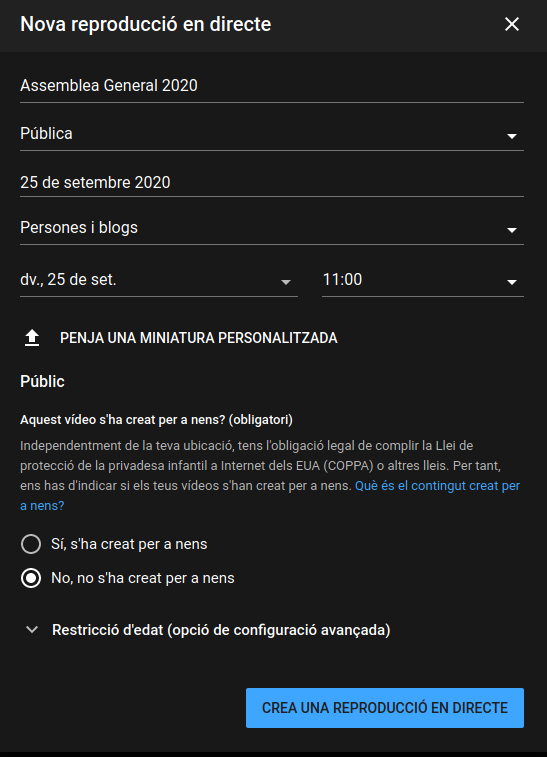
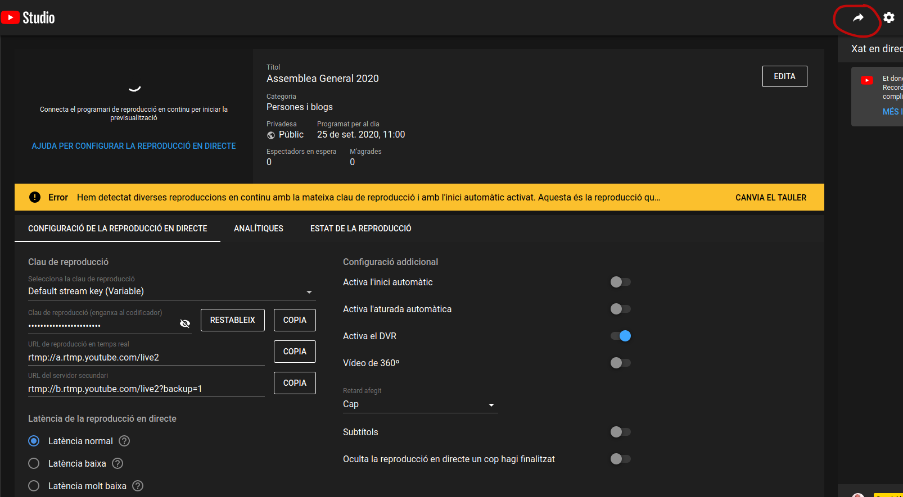
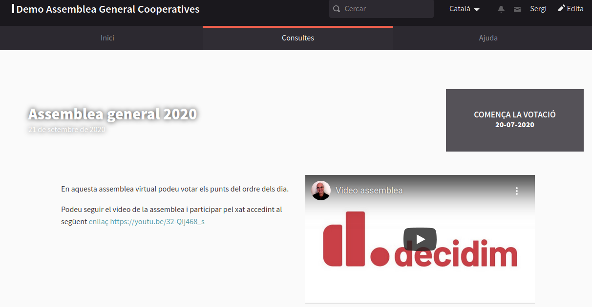

# Mode broadcasting

### Emetre la videoconferència en directe a través de youtube 

Youtube és el servei més extensament utilitzat per emetre vídeo en directe, alguns dels sistemes de videoconferència compten amb opcions per emetre el vídeo de la videoconferència a través de un vídeo de youtube. 

Per no complicar aquesta guía ens centrarem sols en aquest sistena de broadcasting. El que volem fer és realitzar la videoconferència amb les conductores de la reunió a través de alguna de les eines esmentades a [videoconferència](./) i en temps real emetre aquesta videconferencia a través de youtube perquè qualsevol persona que tingui l'enllaç la pugui seguir. 

#### 1. Configurar canal de youtube

Cal comptar amb compte de Google \(com per exemple un compte de gmail\) i [complir un seguit de requisits per tal de poder emetre vídeos en directe](https://support.google.com/youtube/answer/2474026?co=GENIE.Platform%3DDesktop&hl=ca&oco=0). 

#### 2. Planificar un video en directe

1. Accedim a [YouTube Studio](http://studio.youtube.com/).
2. A la part superior dreta, fem clic a Emet en directe  per obrir la Sala de control en directe.
3. Fem clic a la pestanya amb la icona de calendari: **Gestiona**.
4. Fem clic a **Programa una reproducció en directe**.
5. Omplim el formulari amb les nostres dades tal i com mostren les següents imatges

**Quan sigui l'hora d'iniciar la reproducció en directe necessitarem disposar de la "clau de reproducció", que podem copiar fen clic al botó tan com mostra la imatge.** 

### Opcions per connectar sistemes de videoconferència a la emissió en directe de youtube

Sistemes de videoconferència amb connector directe a youtube:

#### Zoom

En la[ següent guia trobareu l'explicació de com fer-ho](https://support.zoom.us/hc/es/articles/360028478292-Transmisi%C3%B3n-de-una-reuni%C3%B3n-o-seminario-web-en-YouTube-Live)

#### Jitsi 

Quan estiguem a la sala de videoconferència, fent clic als tres punts verticals que trobareu abaix a la dreta i **start live creen** i eng i emetre el vídeo resultant per tal de que qualsevol sòcia o convidat pugui seguir la reunió. Les emissions en directe de youtube compten amb un sistema de xat que permet moderació per tal de que les espectadores puguin participar.anxar la **clau de reproducció** que em obtingut a youtube [tal com hem explicat](mode-broadcasting.md#2-planificar-un-video-en-directe)

Altres opcions: 

Quan la opció de emetre vídeo a traves de youtube no està disponible al sistema de videconferència necessitem emprear algun sistema que ens permeti capturar el vídeo de la videoconferència i enviar la informació a youtube. Podem utilitzar el programari lliure [OBS](https://obsproject.com/) per capturar qualsevol vídeo de qualsevol sistema de videotrucades i emetre'l a través de youtube, per exemple [aquí teniu una explicació de com fer-ho si fem servir Skype](https://www.hackdiary.com/2019/01/22/stream-to-youtube-live-from-a-skype-call/)

OBS permet a més editar vídeo en directe, per exemple per afegir caràtules que descriguin qui està parlant o introduint diferents fases de la reunió. 

### Compartir el vídeo de youtube

Fent clic a dalt a la dreta podeu compartir l'enllaç de youtube que permetrà als espectadors veure el vídeo i participar al xat, serà un enllaç del tipus [https://youtu.be/32-QIj468\_s](https://youtu.be/32-QIj468_s) Aquest enllaç el podrem enviar juntament amb la convocatoria.

### Mostrar el vídeo de youtube a Decidim

Per més comoditat podem mostrar el vídeo a Decidim**,** a la pàgina de les votacions. Ho podem fer entrant a la administració del nostre Decidim **Consultes &gt; Consulta en qüestió** editem els següents camps: 

* Descripció: En la pròpia descripció podem afegir el link a youtube que hem obtingut abans
* URL de vídeo introductori: En aquest cas hem de variar la URL, si la URL que vam obtenir era  [https://youtu.be/32-QIj468\_s](https://youtu.be/32-QIj468_s) hem de introduir [https://www.youtube.com/embed/32-QIj468\_s](https://www.youtube.com/embed/32-QIj468_s) és a dir substituir **https://youtu.be/** per **https://www.youtube.com/embed/**

El resultat a la pàgina de votacions serà similar a: 

 

